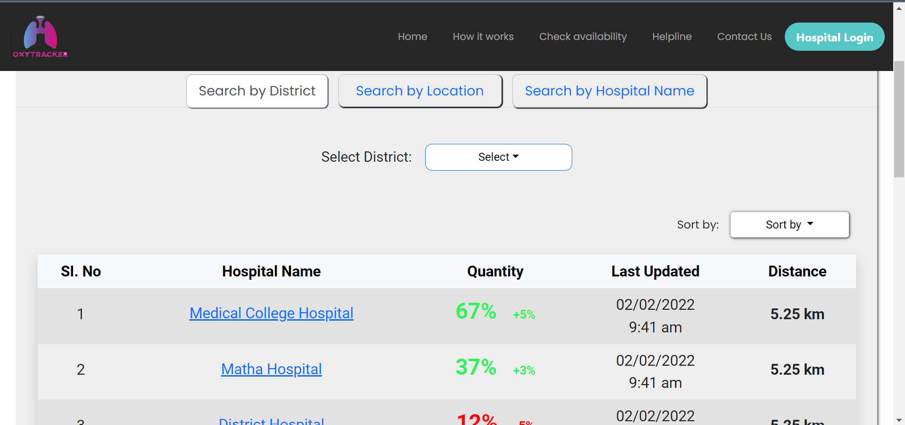
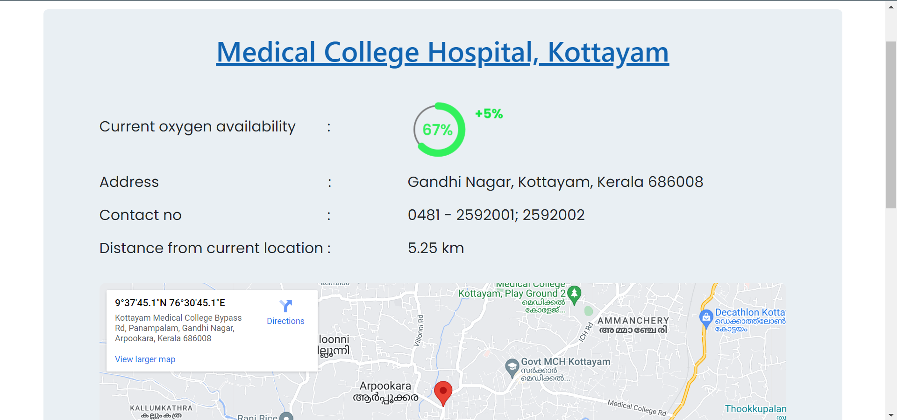

# Oxytracker - A website to monitor oxygen availability

This is the prototype for website OXYTRACKER which can used for monitoring the amount of oxygen availability across various hospitals.

You may view the website by clicking [here](https://nikhilputhumana.github.io/oxytracker-website/)

## 🌐 Usage

* Users can view the amount of oxygen availability in 3 ways:
   * Search by district
   * Search by location
   * Search by hospital name

1. Search by district:  
    The users can select the district from the drop down button and can view the hospitals available on that particular district.
2. Search by location:  
   The users needs to provide location permission and can view the hospitals available nearby the current location.
3. Search by hospital name:  
   Users can directly search the hospitals using the hospital name.
  

### ✨ Sample View

Users can view the quantity of oxygen available in the hospital, distance of hospital from our current location, and the time when the quantity was last updated by the hospitals.   

### 🏥 Hospital details

On clicking the hospital name more details about the hospital can be viewed like the exact location, contact details etc.

### 🔐 Hospital login
There is a button on the home screen for the hospitals to Login or Sign up. After logging in, the hospitals can update the details like amount of oxygen consumed and amount of oxygen received.

Hospitals can also monitor their usage statistics for the past days.

## 📝 License

This project is [MIT](https://github.com/nikhilputhumana/oxytracker-website/blob/main/LICENSE) licensed.